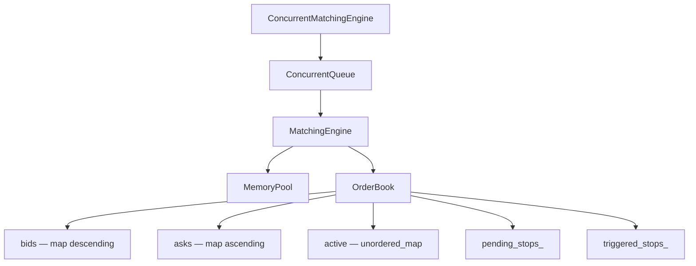
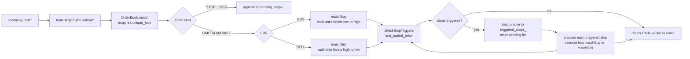

# Limit Order Book Matching Engine

This is a C++17 implementation of a limit order book matching engine — the core component of any exchange or electronic trading platform. Orders are matched using price-time (FIFO) priority, with support for limit, market, iceberg, and stop-loss orders. The project also includes a slab memory pool for order allocation and a lock-free concurrent event queue backed by the Michael-Scott algorithm.

---

## Table of Contents

- [Architecture](#architecture)
- [Order Matching Flow](#order-matching-flow)
- [Price Representation](#price-representation)
- [Order Types](#order-types)
- [Key Design Decisions](#key-design-decisions)
- [Building](#building)
- [Benchmark Results](#benchmark-results)
- [Test Suite](#test-suite)
- [Project Structure](#project-structure)
- [License](#license)

---

## Architecture



`MatchingEngine` is the single-threaded facade used directly. `ConcurrentMatchingEngine` wraps it with a lock-free queue so that multiple producer threads can enqueue events without blocking on matching logic; a single consumer thread drains the queue and dispatches to the underlying `MatchingEngine`.

---

## Order Matching Flow



---

## Price Representation

All prices are stored as `int64_t` values scaled by `PRICE_SCALE = 10000`. A price of `$100.00` is represented as `1000000`, and `$99.50` as `995000`. This avoids floating-point arithmetic in the matching hot path. To convert for display, divide by `10000.0`. All public API parameters follow this convention.

---

## Order Types

| Type | Trigger | Rests in book | Use case |
|------|---------|---------------|----------|
| Limit | Submitted immediately | Yes, if not fully filled | Buy or sell at a specific price or better |
| Market | Submitted immediately | No | Execute immediately at the best available price |
| Iceberg | Submitted immediately | Yes — only `display_qty` is visible | Large orders that should not reveal full size |
| Stop-Loss | When `last_traded_price <= trigger_price` (sell) | No — held in `pending_stops_` | Convert to a limit order when price moves against a position |

### Code examples

```cpp
#include "matching_engine.h"

MatchingEngine engine;

// Limit order — buy 100 shares at $100.00
uint64_t id = engine.submitLimit(Side::BUY, 1000000, 100);

// Market order — sell 50 shares at the best available bid
engine.submitMarket(Side::SELL, 50);

// Iceberg order — buy 500 total, only 100 visible at a time, at $100.00
uint64_t ice_id = engine.submitIceberg(Side::BUY, 1000000, 500, 100);

// Stop-loss order — if last trade reaches $99.50, submit a sell limit at $99.40
uint64_t sl_id = engine.submitStopLoss(Side::SELL, 995000, 994000, 100);

// Cancel or modify by ID
engine.cancelOrder(id);
engine.modifyOrder(ice_id, 1005000, 200);
```

---

## Key Design Decisions

- **`cancelLocked()` private helper.** `modifyOrder` already holds a `unique_lock` on `mutex_` when it needs to remove the existing order. Calling the public `cancelOrder` would attempt to acquire the same lock and deadlock. The private `cancelLocked()` performs the cancellation assuming the lock is already held by the caller.

- **Stop-loss batch pipeline.** After each trade, `checkStopTriggers` scans `pending_stops_` and moves all newly triggered orders into a separate `triggered_stops_` vector, then clears `pending_stops_`. Processing is done from the staged batch rather than the live list, which correctly handles cascading triggers where one stop's fill triggers another stop.

- **Iceberg replenishment in-place.** When the visible tranche of an iceberg order is consumed, `replenish()` refills `display_qty_` from `hidden_qty_` using the original `orig_display_qty_` as the replenishment size. The order pointer remains at its current position in the price-level deque, preserving time priority within the visible quantity, consistent with standard exchange iceberg semantics.

- **`MemoryPool` placement-new outside the lock.** Once a block is removed from the free list, no other thread can reach it until it is returned via `deallocate`. The mutex is released before calling `::new (block->data) T(...)`, so constructor execution does not hold the pool lock. This keeps allocation latency low when constructors are non-trivial.

---

## Building

Requires CMake >= 3.14 and a C++17-capable compiler. The project uses POSIX threads.

```bash
# Release build (default)
make

# Debug build with AddressSanitizer and UBSan
make debug

# Build and run the test suite
make tests

# Build benchmarks
make benchmarks

# Run the demo binary
make run
```

Produced binaries:

| Target | Path |
|--------|------|
| Demo binary | `build/orderbook` |
| Test suite | `build-tests/tests/lob_tests` |
| Benchmark | `build-bench/benchmark/lob_benchmark` |

### CMake directly

```bash
# Release
cmake -S . -B build -DCMAKE_BUILD_TYPE=Release
cmake --build build --parallel

# With tests
cmake -S . -B build-tests -DCMAKE_BUILD_TYPE=Debug -DBUILD_TESTS=ON
cmake --build build-tests --parallel
./build-tests/tests/lob_tests

# With benchmarks
cmake -S . -B build-bench -DCMAKE_BUILD_TYPE=Release -DBUILD_BENCHMARKS=ON
cmake --build build-bench --parallel
```

---

## Benchmark Results

Measured on an AMD Ryzen 5 4600H running WSL2 (Linux), 200,000 events per run.

### Submission latency — single-threaded

| Metric | Value |
|--------|-------|
| Min | 0.037 µs |
| Avg | 0.263 µs |
| P50 | 0.181 µs |
| P95 | 0.492 µs |
| P99 | 1.045 µs |
| P99.9 | 2.522 µs |

### Throughput — single-threaded

| Mode | Orders / sec |
|------|-------------|
| Latency mode | ~3.4 M |
| Throughput mode | ~4.6 M |

### Modify latency — single-threaded

| Metric | Value |
|--------|-------|
| Avg | 0.255 µs |
| P99 | 0.341 µs |

### Concurrent throughput

| Threads | Events / sec |
|---------|-------------|
| 4 producers + 1 consumer | ~2.7 M |

---

## Test Suite

Run with:

```bash
make tests
./build-tests/tests/lob_tests
```

| Module | Tests | Covers |
|--------|-------|--------|
| Order | 12 | Construction, fill, cancel, iceberg replenish, stop-loss trigger |
| OrderBook | 16 | Price-time priority, partial fills, iceberg matching, stop-loss pipeline, cancel, modify, spread |
| MatchingEngine | 11 | Submit limit/market/iceberg/stop-loss, cancel, modify, verbose logging, pool stats |
| MemoryPool | 8 | Allocation, deallocation, slab growth, capacity tracking, concurrent alloc/free |
| ConcurrentQueue | 6 | Enqueue/dequeue, empty queue, multi-producer ordering, sentinel drain |
| **Total** | **53** | |

---

## Project Structure

```
limit-order-book-matching-engine/
├── include/
│   ├── order.h               # Order class, Side/OrderKind/OrderStatus enums, PRICE_SCALE
│   ├── orderbook.h           # OrderBook class, Trade struct
│   ├── matching_engine.h     # MatchingEngine facade
│   └── memory_pool.h         # MemoryPool<T> slab allocator, PoolDeleter
├── src/
│   ├── order.cpp
│   ├── orderbook.cpp
│   ├── matching_engine.cpp
│   └── main.cpp              # Demo: iceberg, stop-loss, multi-threaded, depth view
├── benchmark/
│   ├── lob_benchmark.cpp     # Synthetic workload benchmark
│   ├── baseline_stl.cpp      # STL-only baseline for comparison
│   ├── concurrent_matching_engine.h
│   ├── concurrent_matching_engine.cpp
│   ├── concurrent_queue.h    # Lock-free Michael-Scott queue
│   ├── order_event.h         # Tagged-union event type
│   ├── benchmark.h
│   ├── Makefile
│   └── README.md
├── tests/
│   ├── CMakeLists.txt
│   ├── framework.h           # Minimal test framework (no external deps)
│   ├── test_main.cpp
│   ├── test_order.cpp
│   ├── test_orderbook.cpp
│   ├── test_matching_engine.cpp
│   ├── test_memory_pool.cpp
│   └── test_concurrent.cpp
├── CMakeLists.txt
└── Makefile
```

---

## License

MIT
